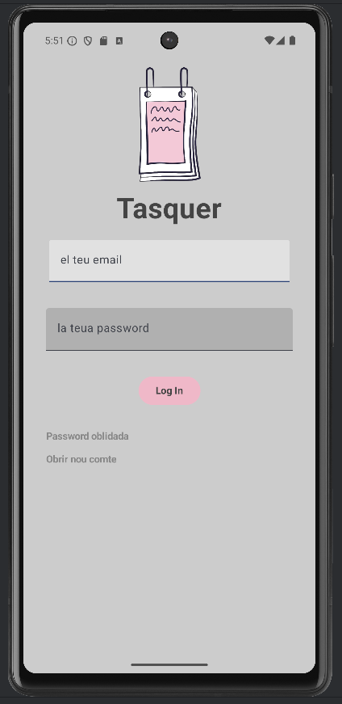
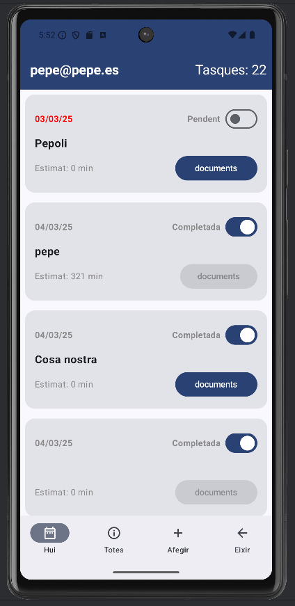
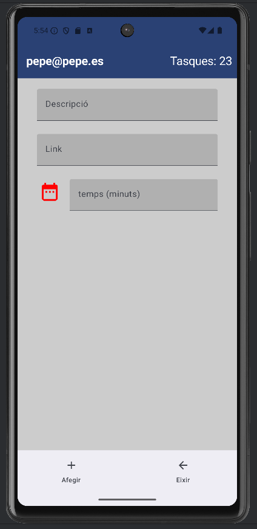
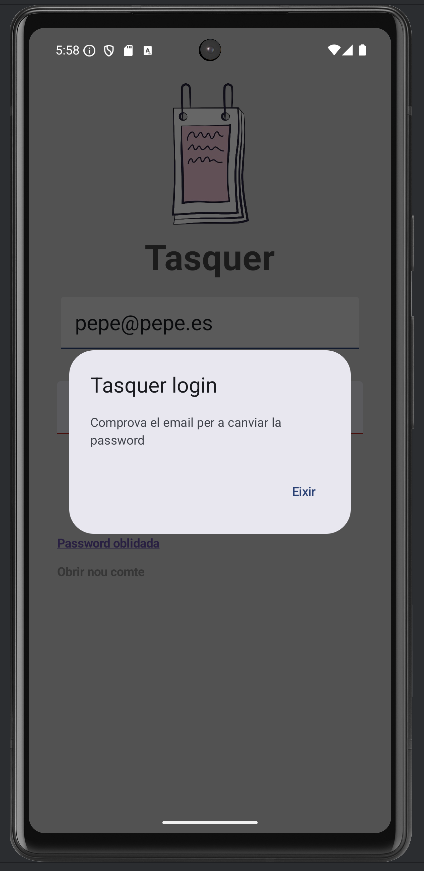
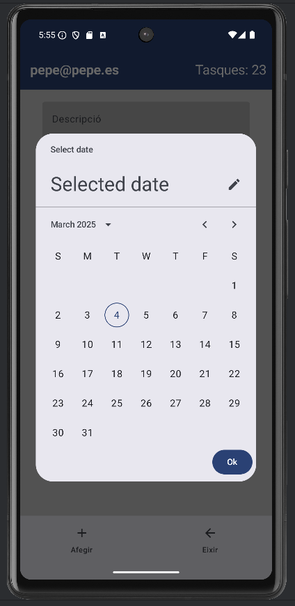
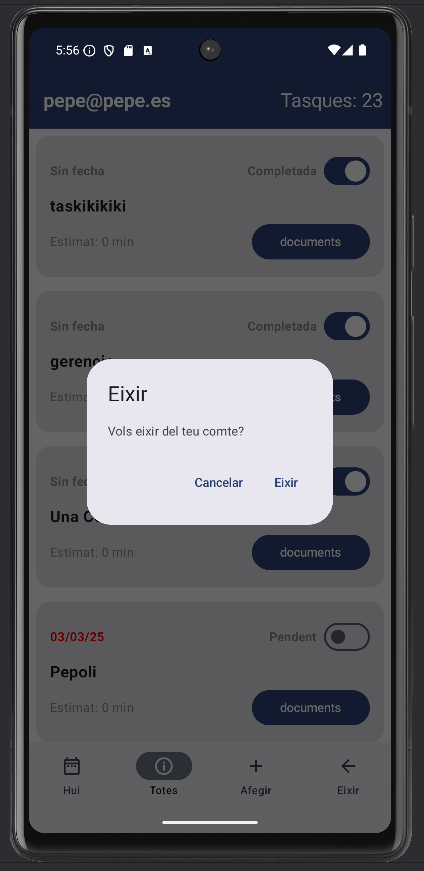
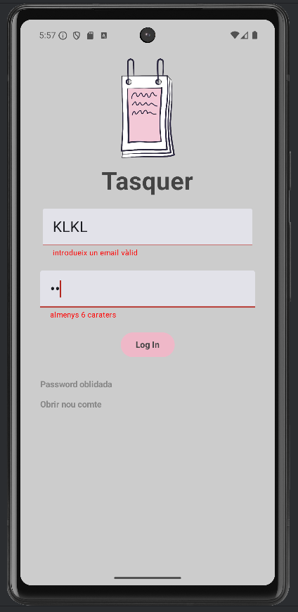
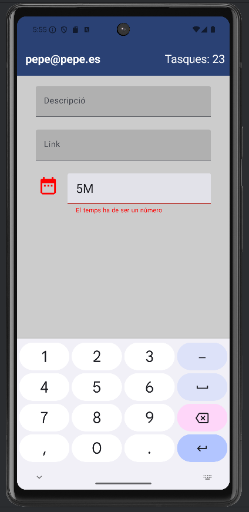
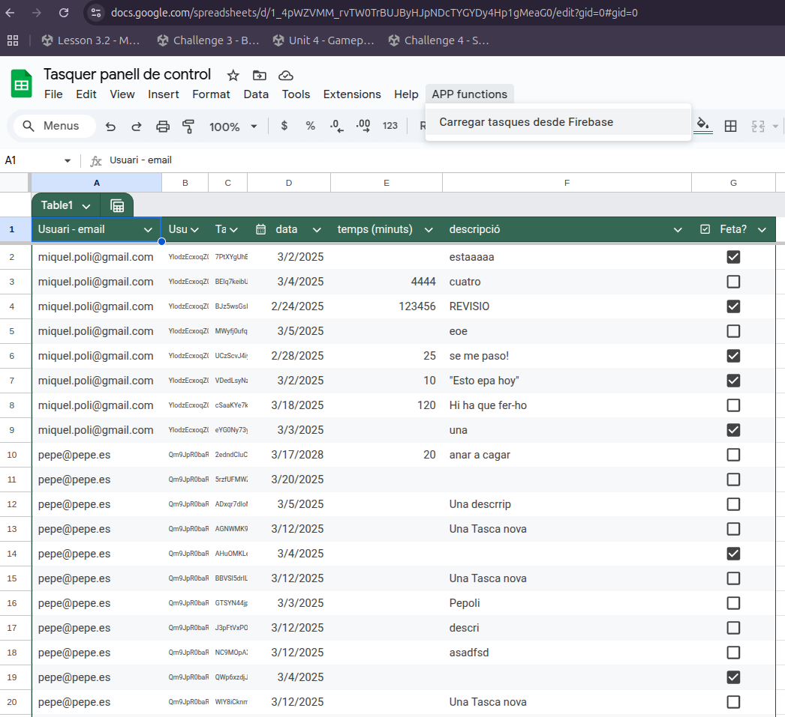

# Tasquer - multiuser task app with Spreadsheets overview
news app loader from RSS

This is a practice for firebase auth, firebase firestore services and jetpack compose paradigm.

https://docs.google.com/spreadsheets/d/1_4pWZVMM_rvTW0TrBUJByHJpNDcTYGYDy4Hp1gMeaG0/edit?usp=sharing

In addition, I've done firebase functions and API services to get info from Google sheets with Google Aps Script.

| LOGIN                                             | RECYCLERVIEW                                                         |
|---------------------------------------------------|----------------------------------------------------------------------|
|||
|||
|||
|||

